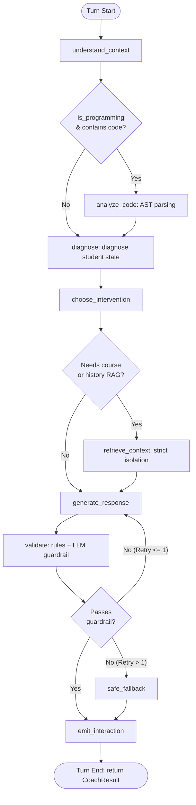

# The Socratic Class — System Architecture

This document describes the high-level architecture, subsystem boundaries, data flow, and pedagogical guardrails of **The Socratic Class**.

```
                           +-----------------------------------+
                           |            Frontend UI            |
                           |   (Chat, Code Editor, Dashboard)  |
                           +-----------------+-----------------+
                                             | HTTP / REST
                                             v
                           +-----------------+-----------------+
                           |          FastAPI Backend          |
                           | (Auth, Sessions, Persistence, API)|
                           +--------+-----------------+--------+
                                    |                 |
                   Internal Service |                 | Internal Service
                           Calls    |                 | Calls
                                    v                 v
                 +------------------+----+       +----+--------------------+
                 |       AI Coach        |       |   Learning Verification |
                 | (LangGraph Dialog Core|       |   (Independent Service  |
                 |  Socratic Guidance)   |       |    Explain/Modify/Xfer) |
                 +---+-----+---------+---+       +-------------------------+
                     |     |         |
                     |     |         | (Static AST Analysis Only)
                     |     |         v
                     |     |    +----------------------+
                     |     |    |  Code Analysis Tool  |
                     |     |    |  (No Code Execution) |
                     |     |    +----------------------+
                     |     v
                     |  +----------------------+
                     |  | Student History Tool |
                     |  |  (Bounded Retrieval) |
                     |  +----------------------+
                     v
             +-----------------------+
             | Course Retrieval Tool |
             | (Strict Course RAG)   |
             +-----------------------+
```

---

## 1. Core Architectural Principles

1. **"Don't Ban AI. Make Learning Visible."**
   Rather than attempting to restrict or detect LLMs, the platform structures interactions so that authentic student understanding, misconceptions, and revisions are continuously observed and recorded.
2. **Coach vs. Verification Boundary Separation**:
   - The **AI Coach** is a turn-by-turn conversational tutor orchestrated via LangGraph. It provides scaffolding and guidance without giving away answers.
   - The **Learning Verification Module** is an independent on-demand assessment service that challenges students across `EXPLAIN`, `MODIFY`, and `TRANSFER` tasks.
3. **Database Ownership Belongs to the Backend**:
   The `ai/` package has zero direct database connections. It is a stateless, pure computational engine. The backend passes context in and receives structured events (`LearningEvent`, `LearningEvidenceCandidate`, `ExternalAIRiskSignal`) to persist.
4. **No Student Code Execution**:
   Student code is analyzed strictly via static AST parsing for syntax validity and structure. Code is **never** executed by the AI service.

---

## 2. Subsystem Responsibilities & Boundaries

| Subsystem | What It Owns | What It Explicitly Does NOT Own |
|---|---|---|
| **AI Coach (`ai/agents/coach/`)** | Diagnosis, intervention choice, response generation, guardrail validation, observable evidence candidate extraction. | Long-term mastery scores, cheating accusations, database access, session persistence. |
| **Learning Verification (`ai/verification/`)** | Challenge generation and evaluation across `EXPLAIN`, `MODIFY`, and `TRANSFER` modes using `ModelRole.VERIFICATION`. | Conversational state management, RAG retrieval. |
| **Tools (`ai/tools/`)** | Bounded interfaces for Course RAG (`CourseRetrievalTool`), Student History (`StudentHistoryTool`), and Static Code Analysis (`CodeAnalysisTool`). | Actual vector storage, embeddings generation, raw database querying. |
| **Backend (`backend/`)** | Authentication, authorization, session lifecycle, REST endpoints, database persistence, transaction management. | Direct LLM prompting or orchestration logic. |
| **Database (`database/`)** | Durable storage of users, courses, assignments, learning sessions, interactions, evidence candidates, and verifications. | Computational logic or AI inference. |

---

## 3. AI Coach LangGraph Execution Lifecycle



### Node Lifecycle Details
1. **`understand_context`**: Increments turn counter, resets turn-level working fields, appends student attempt to message history.
2. **`analyze_code`** (Conditional): Runs safe Python AST analysis. Extracts defined functions, variables, loops, and syntax errors. Records tool in `tools_used`.
3. **`diagnose`**: Uses `ModelRole.REASONING` to categorize student's learning state (`CORRECT_REASONING`, `MISCONCEPTION`, `CONCEPTUAL_GAP`, `PROCEDURAL_ERROR`, `LOGICAL_ERROR`, `CODE_ERROR`, `INCOMPLETE_REASONING`, `UNCERTAIN`).
4. **`choose_intervention`**: Uses `ModelRole.LIGHTWEIGHT` to select pedagogical action (`QUESTION`, `HINT`, `EXPLANATION`, `GUIDED_DEBUGGING`, `FEEDBACK`, `CLARIFICATION`, `ENCOURAGEMENT`).
   - **Deterministic Safeguard**: Under `GUIDED` policy on turn 1, any `EXPLANATION` is deterministically downgraded in code to `QUESTION` unless reasoning is already correct.
5. **`retrieve_context`** (Conditional): Retrieves course materials with strict `course_id` isolation or bounded student history.
6. **`generate_response`**: Uses `ModelRole.COACH` to formulate supportive, Socratic guidance.
7. **`validate`**: Evaluates draft against policy guardrails (rule-based checks + lightweight LLM review).
8. **`safe_fallback`**: Emits a guaranteed safe guiding question if validation fails repeatedly.
9. **`emit_interaction`**: Extracts observable `evidence_candidates` and `risk_signals` linked to the durable `learning_event.id`.

---

## 4. Multi-Provider LLM Abstraction

All LLM instantiation flows through `ai.models.llm` and `ai.config`:

```
                    +------------------------------------+
                    |        Environment (.env)          |
                    | (AI_PROVIDER, AI_API_KEY, etc.)   |
                    +-----------------+------------------+
                                      |
                                      v
                    +-----------------+------------------+
                    |          ai.config.py              |
                    |   (ModelConfig, ModelRole,         |
                    |    validation, secret masking)     |
                    +-----------------+------------------+
                                      |
                                      v
                    +-----------------+------------------+
                    |       ai.models.llm.py             |
                    |  (get_llm, get_structured_llm)     |
                    +----+------------+------------+-----+
                         |            |            |
                         v            v            v
                     [OpenAI]     [Anthropic]   [NVIDIA NIM /
                                                OpenAI-Compatible]
```

### Role Model Mapping
- **`ModelRole.COACH`**: High-empathy student dialogue and tutoring (`gpt-4o-mini`, `claude-3-5-haiku`).
- **`ModelRole.REASONING`**: Deep conceptual diagnosis and misconception identification (temperature 0.2).
- **`ModelRole.LIGHTWEIGHT`**: Fast routing, intervention choices, and guardrail validation.
- **`ModelRole.VERIFICATION`**: Rigorous conceptual evaluation of `EXPLAIN`, `MODIFY`, and `TRANSFER` responses.

---

## 5. Security & Isolation

1. **Zero Secret Leakage**: API keys and tokens are masked (`[CONFIGURED]` / `[NOT SET]`) in all logs, representations, and error messages.
2. **Strict Course RAG Isolation**: `CourseRetrievalTool` strictly discards chunks where `course_id` does not match the active session. Cross-course data contamination is impossible.
3. **Traceability**: Every evidence candidate includes `source_event_ids` linking directly to the originating `LearningEvent` or `VerificationResult` ID.
