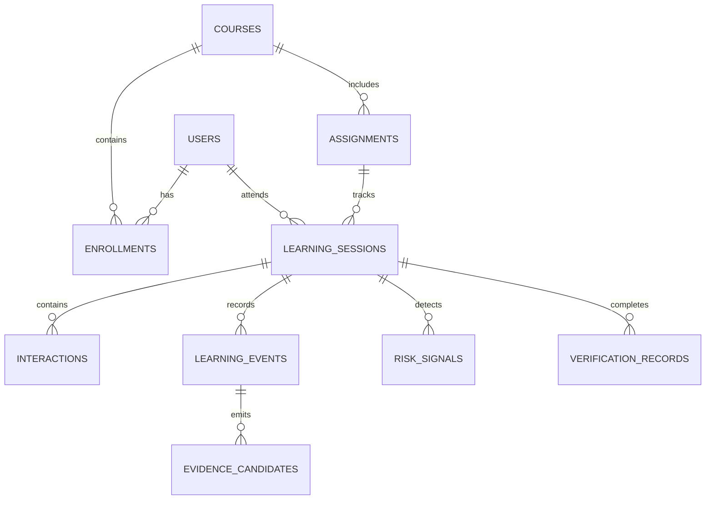

# The Socratic Class — Database & Domain Models

This document defines the persistent schema and domain relationships managed by the Backend database to support the AI Coach and Learning Verification modules.

The `ai/` package remains purely computational and stateless; the tables below represent the durable entities persisted by `backend/`.

---

## 1. Entity-Relationship Overview



---

## 2. Table Specifications

### 2.1 `users`
Represents students, teaching assistants, and instructors.
```sql
CREATE TABLE users (
    id VARCHAR(64) PRIMARY KEY,
    email VARCHAR(255) UNIQUE NOT NULL,
    full_name VARCHAR(255) NOT NULL,
    role VARCHAR(32) NOT NULL DEFAULT 'student', -- 'student', 'ta', 'instructor'
    created_at TIMESTAMP WITH TIME ZONE DEFAULT CURRENT_TIMESTAMP,
    updated_at TIMESTAMP WITH TIME ZONE DEFAULT CURRENT_TIMESTAMP
);
```

### 2.2 `courses`
Academic courses or training modules.
```sql
CREATE TABLE courses (
    id VARCHAR(64) PRIMARY KEY,
    code VARCHAR(32) UNIQUE NOT NULL,       -- e.g. 'CS-101'
    title VARCHAR(255) NOT NULL,
    description TEXT,
    created_at TIMESTAMP WITH TIME ZONE DEFAULT CURRENT_TIMESTAMP
);
```

### 2.3 `assignments`
Individual tasks, coding exercises, or homework assignments.
```sql
CREATE TABLE assignments (
    id VARCHAR(64) PRIMARY KEY,
    course_id VARCHAR(64) NOT NULL REFERENCES courses(id) ON DELETE CASCADE,
    title VARCHAR(255) NOT NULL,
    instructions TEXT NOT NULL,
    subject_area VARCHAR(128),
    is_programming BOOLEAN NOT NULL DEFAULT FALSE,
    default_policy VARCHAR(32) NOT NULL DEFAULT 'GUIDED', -- 'GUIDED', 'ASSISTED', 'OPEN'
    created_at TIMESTAMP WITH TIME ZONE DEFAULT CURRENT_TIMESTAMP
);

CREATE INDEX idx_assignments_course ON assignments(course_id);
```

### 2.4 `learning_sessions`
Active interactive tutoring sessions between a student and the Coach.
```sql
CREATE TABLE learning_sessions (
    id VARCHAR(64) PRIMARY KEY,
    student_id VARCHAR(64) NOT NULL REFERENCES users(id) ON DELETE CASCADE,
    assignment_id VARCHAR(64) NOT NULL REFERENCES assignments(id) ON DELETE CASCADE,
    policy VARCHAR(32) NOT NULL DEFAULT 'GUIDED',
    is_active BOOLEAN NOT NULL DEFAULT TRUE,
    turn_count INT NOT NULL DEFAULT 0,
    started_at TIMESTAMP WITH TIME ZONE DEFAULT CURRENT_TIMESTAMP,
    ended_at TIMESTAMP WITH TIME ZONE
);

CREATE INDEX idx_sessions_student_asg ON learning_sessions(student_id, assignment_id);
```

### 2.5 `interactions`
Turn-by-turn dialogue records generated by `ai.models.schemas.AIInteraction`.
```sql
CREATE TABLE interactions (
    id VARCHAR(64) PRIMARY KEY,
    session_id VARCHAR(64) NOT NULL REFERENCES learning_sessions(id) ON DELETE CASCADE,
    turn_index INT NOT NULL,
    intervention_type VARCHAR(64) NOT NULL,
    assistance_level VARCHAR(32) NOT NULL,
    diagnosis_category VARCHAR(64) NOT NULL,
    diagnosis_concept VARCHAR(128),
    diagnosis_confidence FLOAT NOT NULL,
    student_attempt TEXT NOT NULL,
    coach_response TEXT NOT NULL,
    referenced_concepts JSONB DEFAULT '[]'::jsonb,
    tools_used JSONB DEFAULT '[]'::jsonb,
    created_at TIMESTAMP WITH TIME ZONE DEFAULT CURRENT_TIMESTAMP
);

CREATE INDEX idx_interactions_session ON interactions(session_id);
```

### 2.6 `learning_events`
Immutable append-only event stream generated by `ai.models.schemas.LearningEvent`.
```sql
CREATE TABLE learning_events (
    id VARCHAR(64) PRIMARY KEY,
    student_id VARCHAR(64) NOT NULL REFERENCES users(id) ON DELETE CASCADE,
    assignment_id VARCHAR(64) NOT NULL REFERENCES assignments(id) ON DELETE CASCADE,
    session_id VARCHAR(64) NOT NULL REFERENCES learning_sessions(id) ON DELETE CASCADE,
    event_type VARCHAR(64) NOT NULL, -- 'AI_INTERACTION', 'ATTEMPT', 'REVISION', 'VERIFICATION'
    timestamp TIMESTAMP WITH TIME ZONE DEFAULT CURRENT_TIMESTAMP,
    payload JSONB NOT NULL DEFAULT '{}'::jsonb
);

CREATE INDEX idx_learning_events_student ON learning_events(student_id, assignment_id);
CREATE INDEX idx_learning_events_type ON learning_events(event_type);
```

### 2.7 `evidence_candidates`
Discrete observable moments of learning emitted by `extract_evidence_candidates(...)`.
```sql
CREATE TABLE evidence_candidates (
    id VARCHAR(64) PRIMARY KEY,
    student_id VARCHAR(64) NOT NULL REFERENCES users(id) ON DELETE CASCADE,
    assignment_id VARCHAR(64) NOT NULL REFERENCES assignments(id) ON DELETE CASCADE,
    concept VARCHAR(128),
    evidence_type VARCHAR(64) NOT NULL, -- 'UNDERSTANDING', 'MISCONCEPTION', 'REVISION', 'INDEPENDENCE', 'EXPLANATION', 'TRANSFER'
    strength VARCHAR(32) NOT NULL,       -- 'STRONG', 'MODERATE', 'WEAK'
    observation TEXT NOT NULL,
    source_event_ids JSONB DEFAULT '[]'::jsonb,
    created_at TIMESTAMP WITH TIME ZONE DEFAULT CURRENT_TIMESTAMP
);

CREATE INDEX idx_evidence_student_concept ON evidence_candidates(student_id, concept);
CREATE INDEX idx_evidence_type ON evidence_candidates(evidence_type);
```

### 2.8 `risk_signals`
Observable structural anomalies across attempts emitted by `extract_risk_signals(...)`.
```sql
CREATE TABLE risk_signals (
    id VARCHAR(64) PRIMARY KEY,
    session_id VARCHAR(64) NOT NULL REFERENCES learning_sessions(id) ON DELETE CASCADE,
    signal VARCHAR(128) NOT NULL,       -- e.g. 'unusually_large_attempt_jump'
    observation TEXT NOT NULL,
    metadata JSONB DEFAULT '{}'::jsonb,
    created_at TIMESTAMP WITH TIME ZONE DEFAULT CURRENT_TIMESTAMP
);

CREATE INDEX idx_risk_signals_session ON risk_signals(session_id);
```

### 2.9 `verification_records`
Permanent logs of completed learning verification challenges from `ai/verification/`.
```sql
CREATE TABLE verification_records (
    id VARCHAR(64) PRIMARY KEY,
    student_id VARCHAR(64) NOT NULL REFERENCES users(id) ON DELETE CASCADE,
    assignment_id VARCHAR(64) NOT NULL REFERENCES assignments(id) ON DELETE CASCADE,
    concept VARCHAR(128) NOT NULL,
    verification_type VARCHAR(32) NOT NULL, -- 'EXPLAIN', 'MODIFY', 'TRANSFER'
    outcome VARCHAR(32) NOT NULL,           -- 'PASS', 'PARTIAL', 'NEEDS_RETRY', 'INSUFFICIENT_EVIDENCE'
    score FLOAT NOT NULL,
    confidence FLOAT NOT NULL,
    feedback TEXT NOT NULL,
    criteria_evaluations JSONB DEFAULT '[]'::jsonb,
    created_at TIMESTAMP WITH TIME ZONE DEFAULT CURRENT_TIMESTAMP
);

CREATE INDEX idx_verifications_student_asg ON verification_records(student_id, assignment_id);
CREATE INDEX idx_verifications_concept ON verification_records(concept);
```

---

## 3. High-Frequency Query Patterns & Indexes

1. **Active Turn Context Retrieval**:
   - `SELECT * FROM interactions WHERE session_id = :session_id ORDER BY turn_index DESC LIMIT 8;`
   - Supported by `idx_interactions_session`.
2. **Prior Concept History for History Tool**:
   - `SELECT payload FROM learning_events WHERE student_id = :student_id AND assignment_id = :assignment_id ORDER BY timestamp DESC LIMIT 3;`
   - Supported by `idx_learning_events_student`.
3. **Evidence Aggregation for Analytics**:
   - `SELECT evidence_type, strength, COUNT(*) FROM evidence_candidates WHERE student_id = :student_id GROUP BY evidence_type, strength;`
   - Supported by `idx_evidence_student_concept`.
